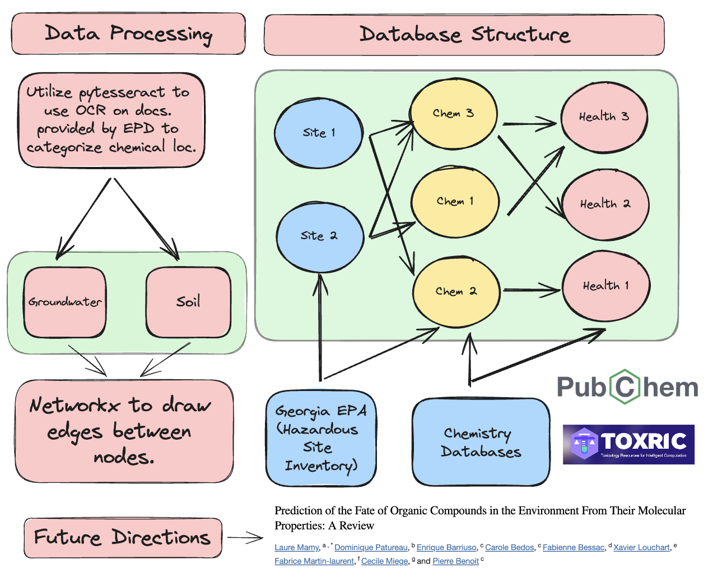
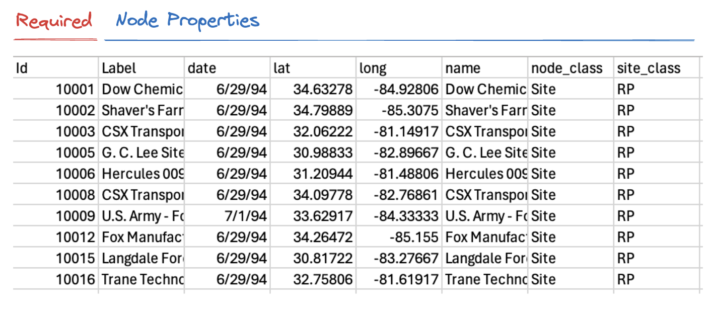
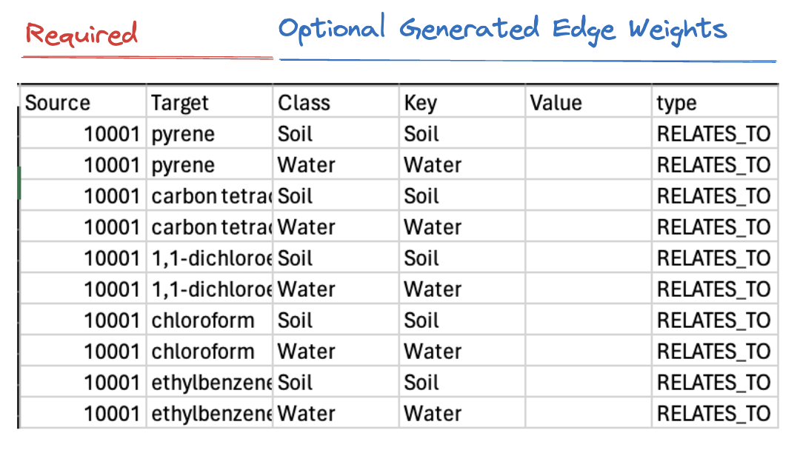
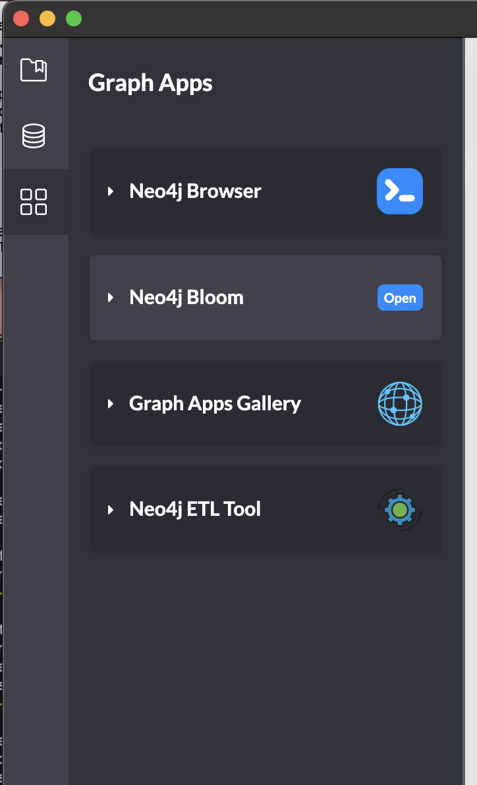
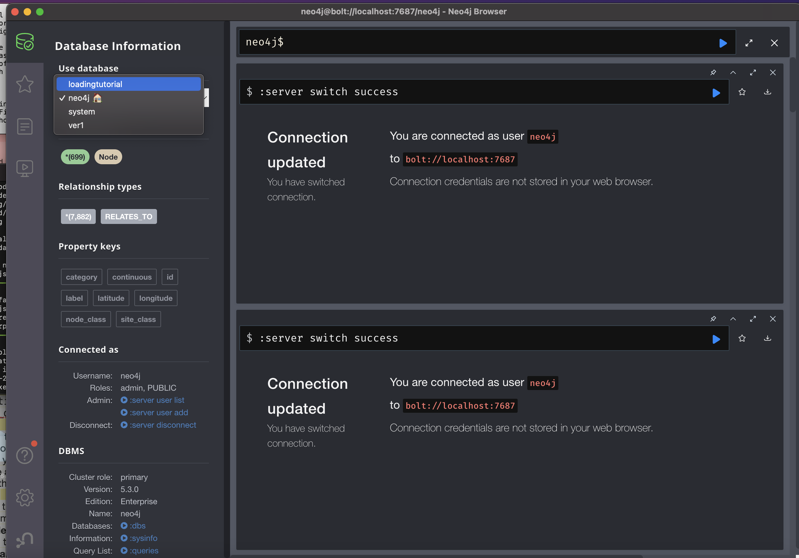

# Documentation For Georgia EPD Hazardous Waste Site to Chemical Relation Neo4j Database Hosting

**Author:** Ken Nakatsu  
**Date:** November 2023



## Python Shiny App (app.py stored here)

Please feel free to visit our R-shiny app at [This Link](https://kenminsoo.shinyapps.io/mvp_geohazard-graphdb/)! This way you don't need to learn cypher and can just query and gain some basic insights into this database. 

## Data Processing and Graph Creation

### Overview

Building the graph databases generally consists of two parts (a) preprocessing the data and (b) drawing edges between nodes. The advantages of a graph database are that we can quickly and easily update the database with complex information. Information on how to do this is at the end of this document. This can include metadata, chemical structures, and more. Imagine this—a collaborative team of social scientists, computational chemists, and environmental scientists all appending data to the graph database to add data such as chemical half-lives (through the properties of the structure), reactions that may interfere with biotic processes, or even geographical data to site nodes.

### Data Sources

1. EPD Hazardous Site Inventory (For site data): [Link](https://epd.georgia.gov/about-us/land-protection-branch/hazardous-waste/hazardous-site-inventory)
2. TOXRIC database which connects chemicals to their potential health or environmental effects: [Link](https://toxric.bioinforai.tech/)
3. Hazardous Substances Data Bank (HSDB) from Pubchem: [Link](https://pubchem.ncbi.nlm.nih.gov/source/11933#data=Annotations)

## Accessing Data

This section will provide a few different cases of useful queries. Documentation for the Cypher language which Neo4J uses to retrieve data can be found here: [Link](https://neo4j.com/developer/cypher/) 

### Obtain All Sites that Had At Least One Chemical with Developmental Toxicity and Count the Number of Chemicals in Ground Water

Syntax is as follows: MATCH (tempname:Node-Name {Filtering Conditions}-[edge:Edge-Name]-(tempname2:Node-Name)

```cypher
MATCH (env:Node {id: 'Dev_Toxic'})-[edge:RELATES_TO]
-(pointed:Node)-[tosite:RELATES_TO{category:"Water"}]
-(sitenode:Node {node_class: "Site"})

RETURN sitenode.label as Site_Name, count(*) as counts, 

ORDER BY counts DESC
```

What this command is doing is essentially obtaining finding all nodes that are one degree away from the developmental toxicity node. This returns all of the chemicals. Then the second "query" in the command is getting all of the nodes one more degree away from that one. We then filter for edges that are "Water" edges which indicates that the chemical has come from a water source. Finally,  we need to ensure that only Site is returned. We then count the number of times it appears, and thus we obtain the number of chemicals associated with each site.


It is now trivial to plot information about the number of chemicals. The database is easily adaptable to answer many questions once a few commands are learned!

## Updating Data

### Node File Structure



### Creating new nodes

Loading in nodes is quite easy as new nodes can always be created.

1. Load in csv file
2. Assign node properties

```cypher
LOAD CSV WITH HEADERS FROM <nodes.csv> AS row

CREATE (:Node { id: row.Id, label: row.Label, prop1: row.prop1})
```

### Edge File Structure

Ensure to generate a file that has the targets and the sources. Make sure to keep a file with all of the nodes, keeping backups, to ensure that all source->target relationships are valid. Edge weights are arbitrary and can be assigned as needed.



### Creating new edges

The process of creating edges involves:

1. Loading your csv file
2. Assigning them to variables
3. Matching source and targets to the Node object
4. Finally, creating edges and assigning them weights

```cypher
LOAD CSV WITH HEADERS FROM <edges.csv> AS row

WITH row.Key as class, row.Value as value,
row.Source as Source, row.Target as Target

MATCH (source:Node {id: Source}), (target:Node {id: Target})

CREATE (source)-[:RELATES_TO {continuous:value, category:class}]->(target)
```

## Loading in the Graph Database and Setting up The Environment

This section is about loading the graph dump that has been created. Please download and follow the instructions for your respective platform. [Download](https://neo4j.com/download/)

### Creating the project


Associate it with the directory that has the dump file. The dump file is included in the github repository associated with this project.

### Loading the dump


Load in the dump by creating new DBMS or importing it into an existing one. Name it and give it a password if prompted.

### Opening the browser and Loading Database IN



Click on the four boxes on the left. Click on the browser.



Then when the browser is open (ensure that the database is also started!), click on the drop-down menu under Use Database, then click on the name of the dump.